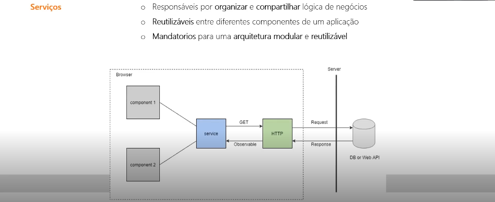
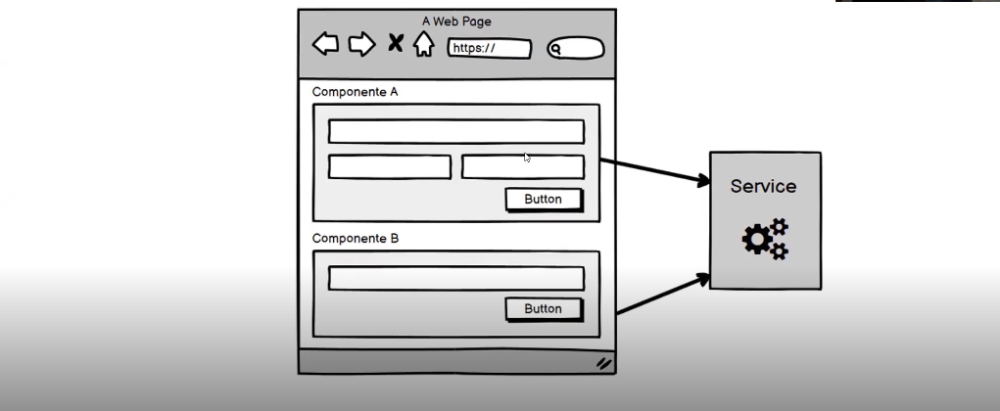
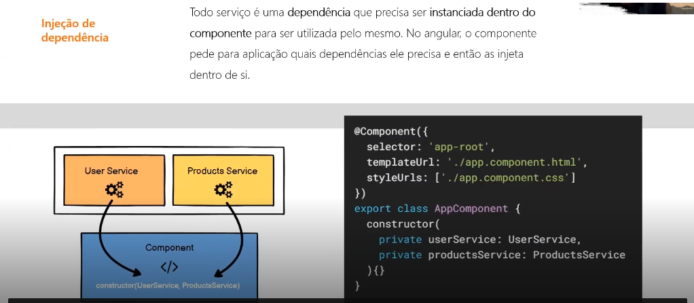

# Projetos Angular

Repositório para projetos praticos do curso de Angular

## O que são **Components** ?
* _Components_ são **DIV's Containers** onde seram criados partes da aplicação como por exemplo, **HEADER**, **NAVBAR**, **Slider Cards** entre outros
1. Exemplo

A arquitetura de **Components** baseia-se na construção de **Components** que sejam independentes, reutilizaveis e modulares. Seus benefícios incluem:
* Escalabilidade
* Manutenção
* Perfomance

## O que são **Services** ??
* Conforme a Arquitetura do Angular a utilização de **Serviços(SERVICES)** tem o propósito de organizar a aplicação, isolando **lógica de negócio** e separando-a dos **Controllers**. Fazendo então a tratativa dos **Components**, chamando programas externos(**API**). Não é possível afirmar que seja obrigatório utilizar **serviços(SERVICES)**, mas é muito desejável para ter uma **arquitetura modular**.
1. Exemplo.

No exeplo 1 temos dois **Components** ligados ao um **Service** fazendo uma requisição **GET** ao um programa externo(**API**) retornando uma resposta(**Response**) ao **Service** fazendo uma **Promise** ou **Contrato** utilizando um recurso do **Angular** chamado **Observable**.
2. Exemplo.

No exemplo 2 vemos um formulário ligado ao **Service** fazendo a tratativa da validação desse formulário

## O que é **Injeção de Dependência** ??
Se resumo a como você vai usar um **Service** no seu **Component**, e para fazer isso usamos a **Injeção de Dependência** do **Angular**, e para o **Angular** todo **Service** é uma **Dependência**, e a gente nunca cria um **Service** dentro de um **Component** nós instânciamos ele. Pegamos a instância desse **Service** que já existe na aplicação e falamos o que queremos usar, e através do **Constructor** falamos para o **Angular** o que queremos usar e apartir disso o **Service** está **INJETADO** no **Component** assim como no exemplo abaixo. E depois é só chamar os métodos que você precisa e ser feliz!
1. Exemplo
