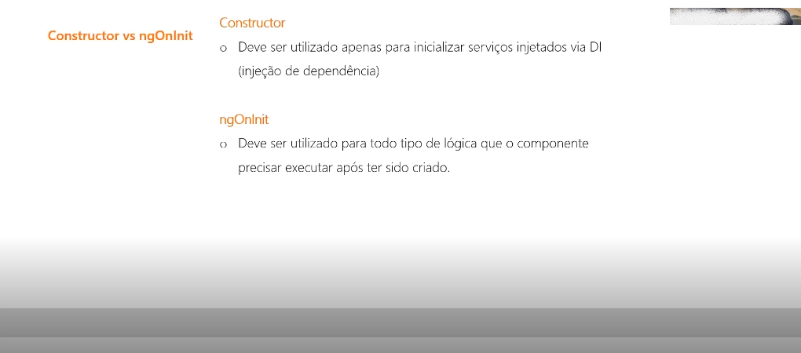

# Projetos Angular

Repositório para projetos praticos do curso de Angular e explicações sobre as funções do Angular.

## O que são **Components** ?
* _Components_ são **DIV's Containers** onde seram criados partes da aplicação como por exemplo, **HEADER**, **NAVBAR**, **Slider Cards** entre outros
1. Exemplo

A arquitetura de **Components** baseia-se na construção de **Components** que sejam independentes, reutilizaveis e modulares. Seus benefícios incluem:
* Escalabilidade
* Manutenção
* Perfomance

## Ciclo de vida de um **Component**
* Todo **Component** vai ter seu ciclo de vida(**Lifecycle Hooks**) que são os estagios(**Stations**) dele dentro da aplicação. A ideia é que tenhamos controle sobre fazer uma alteração ou executar algum código sempre que algum desses **Stations** forem acionados no **Component**.
1. Exemplo.

No exemplo acima vemos que quando temos alguma alteração no **Component**, os **Lifecycle Hooks** são disparados. É algo que usamos com sabedoria pq pode deixar a aplicação anti-performatica, sempre que chamarmos um método sempre que acontece alguma alteração no **Push** vai acabar dado alguns problemas de performace
Alguns desses **Lifecycle Hooks** são:
* NgOnInit() - Assim que o **Component** é inicializado
* NgOnDestroy() - Quando o **Component** é destruido da aplicação
2. Exemplo.

No exeplo 2 vemos a sequência de inicialização dos Lifecyclo hooks ou para melhor entendimento só chamamos de **Hooks**. O padão do Angular é chamar o **NgOnInit()** primeiro, porém existe alguns **Component** que vão receber dados deoutros **Component** e quando isso acontece o **NgOnInit()** precisa primeiro pssar pelo **NgOnChanges()** porque ele vai ser acionado assim que tiver uma mudança de dados de entrada ou saída.
3. Exemplo de **BONÚS**.

Só devemos citar valores ou chamar métodos e etc.. no ngOnInit().

## O que são **Services** ??
* Conforme a Arquitetura do Angular a utilização de **Serviços(SERVICES)** tem o propósito de organizar a aplicação, isolando **lógica de negócio** e separando-a dos **Controllers**. Fazendo então a tratativa dos **Components**, chamando programas externos(**API**). Não é possível afirmar que seja obrigatório utilizar **serviços(SERVICES)**, mas é muito desejável para ter uma **arquitetura modular**.
1. Exemplo.

No exeplo 1 temos dois **Components** ligados ao um **Service** fazendo uma requisição **GET** ao um programa externo(**API**) retornando uma resposta(**Response**) ao **Service** fazendo uma **Promise** ou **Contrato** utilizando um recurso do **Angular** chamado **Observable**.
2. Exemplo.

No exemplo 2 vemos um formulário ligado ao **Service** fazendo a tratativa da validação desse formulário

## O que é **Injeção de Dependência** ??
Se resumo a como você vai usar um **Service** no seu **Component**, e para fazer isso usamos a **Injeção de Dependência** do **Angular**, e para o **Angular** todo **Service** é uma **Dependência**, e a gente nunca cria um **Service** dentro de um **Component** nós instânciamos ele. Pegamos a instância desse **Service** que já existe na aplicação e falamos o que queremos usar, e através do **Constructor** falamos para o **Angular** o que queremos usar e apartir disso o **Service** está **INJETADO** no **Component** assim como no exemplo abaixo. E depois é só chamar os métodos que você precisa e ser feliz!
1. Exemplo


## O que é **Data-Binding** ?
1. Exemplo.

No exemplo acima o meu **Component** é a parte lógica e o meu **Template** a  parte visual, tudo o que o usuário irá ver, e para passar valores de um **Template** pra o outro usamos um desses 4 diferentes **Data-Binding**.
* 1° - **String Interpolation**, quando queremos mostrar algum valor do tipo **String** ou um tipo mais **Primitivo**, que é para pegar um dado do **Component** e mostrar ele no **Template HTML**.
* 2° - **Property Binding**, vai pegar um dado do **Component** e controlar uma **Propriedade** do **Template HTML**, por exemplo a **Source** de uma imagem através do próprio **Component**.
* 3° - **Event Binding**, vai disparar eventos esperando uma resposta do **Component**.
* 4° - **Two-Way Data-Binding**, os dados vão ser atualizados ambos os lados, tanto do **Component** como do **Template**.

## Compartilhar dados com as propriedades **@Input()** **@Output()** dos components
1. Exemplo.

No exemplo acima, vamos imaginar que o **Component Pai** precisa dar dinheiro para o **Component Filho**, e no **Component Pai** iniciamos o dinheiro no **Constructor** porque é apenas uma variavel e não depende do **Component** em sí, no **Component Filho** entre conchetes passamos o nome da propriedade que o **Component Filho** está esperando, passando a propriedade no **Template HTML** no **Selector** e passando igual a variavel que o pai tem que é o **money** ``` <app-filho [earnedMoney]="money"></app-filho> ```.
2. Exemplo.

No exemplo 2 vemos o inverso, o **Component Filho** devolvendo dinheiro para o **Component Pai**. Para isso utilizamos o **@Output()** e o **EventEmitter**, que é a maneira de como o **Component Filho** compitilha dados com o **Component Pai**.
* Criamos o **@Output()** no **Component Filho** que é o dinheiro que o **Component Filho** quer devolver para o **Component Pai**, para isso utilizamos o **EventEmitter** que serve para criarmos nossos próprios eventos, da mesma forma que podemos escutar um **Click** podemos escutar o evento **remainingMoney** atribuindo um valor do evento a uma função passando o evento que o **Component Filho** esta mandando ``` <app-pai [remainingMoney]="receiveMoney($event)"></app-pai> ```. e chamamos o método retornando o dinheiro de uma compra do **Component Filho** ao **Component Pai**
**OBS:** ``` this.remainingMoney.EventEmitter().(change); ```